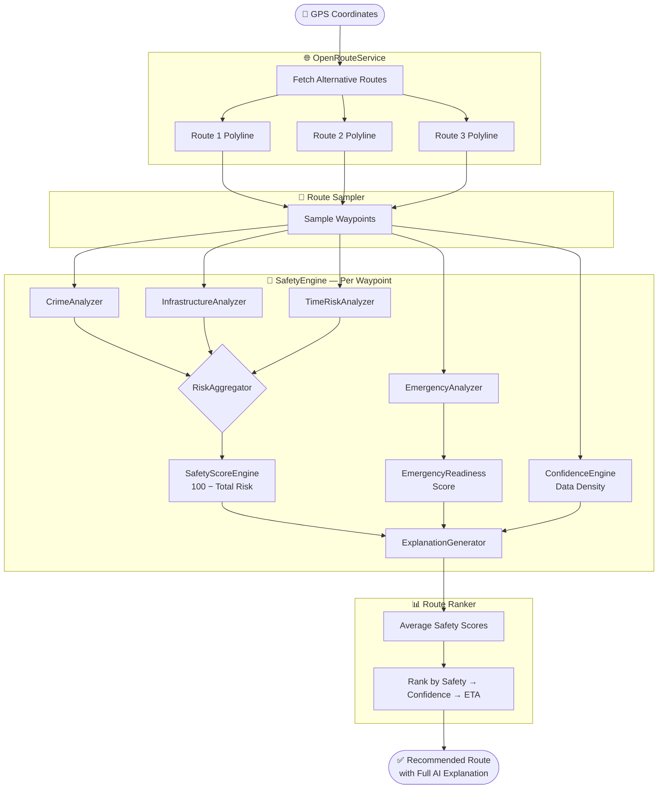
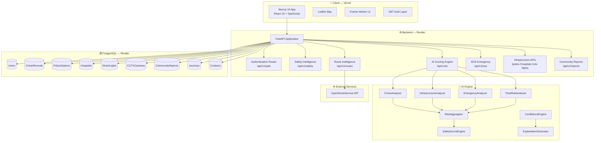
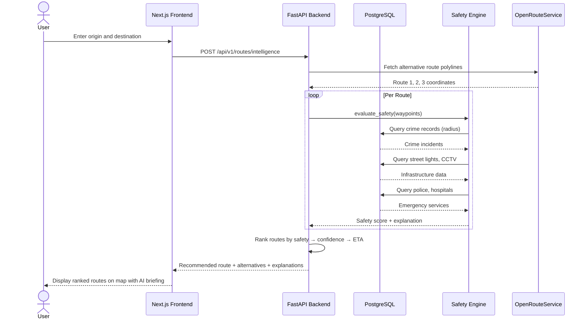
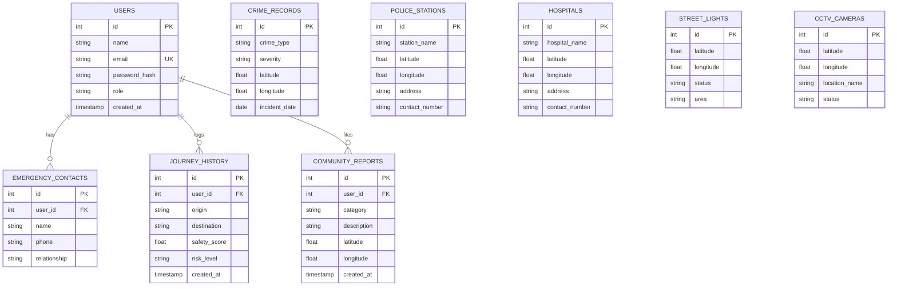
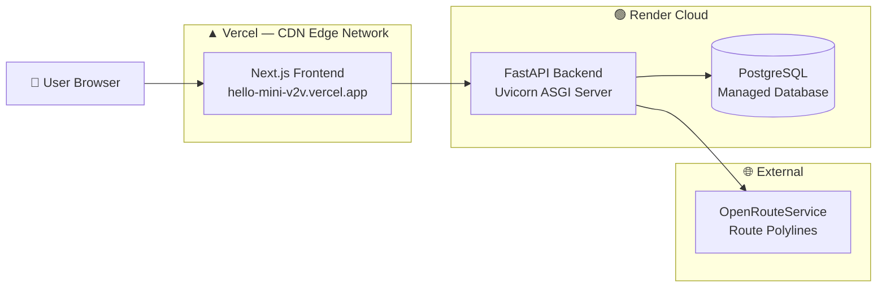

<div align="center">


# 🛡️ SafeRoute AI

### **AI-Powered Pedestrian Safety Intelligence Platform**

> *The intelligent routing system that recommends the **safest route**, not just the fastest one.*

<br/>

[](https://python.org)
[](https://fastapi.tiangolo.com)
[](https://nextjs.org)
[](https://reactjs.org)
[](https://typescriptlang.org)
[](https://postgresql.org)
[](https://sqlalchemy.org)

[](https://vercel.com)
[](https://render.com)
[](https://openrouteservice.org)
[](https://leafletjs.com)
[](LICENSE)

<br/>

**[Live Demo](https://hello-mini-v2v.vercel.app)** • **[API Docs](https://saferoute-ai.onrender.com/api/v1/docs)** • **[Report Bug](https://github.com/KartikGupta06/Hello_Mini-v2v/issues)**

</div>

---

## 📋 Table of Contents

- [The Problem](#-the-problem)
- [Why SafeRoute AI?](#-why-saferoute-ai)
- [What Makes It Different](#-what-makes-it-different)
- [Core Features](#-core-features)
- [AI Safety Engine](#-ai-safety-engine)
- [System Architecture](#-system-architecture)
- [Request Lifecycle](#-request-lifecycle)
- [Tech Stack](#-tech-stack)
- [Project Structure](#-project-structure)
- [Database Design](#-database-design)
- [Deployment Architecture](#-deployment-architecture)
- [API Documentation](#-api-documentation)
- [Local Installation](#-local-installation)
- [Environment Variables](#-environment-variables)
- [Demo Credentials](#-demo-credentials)
- [Security](#-security)
- [Future Roadmap](#-future-roadmap)
- [Why This Matters](#-why-this-matters)
- [License](#-license)

---

## 🚨 The Problem

Every major navigation application on the market — Google Maps, Apple Maps, Waze — solves exactly one problem: **how to get from A to B as fast as possible**.

None of them answer the more important question: **is this route safe to walk?**

Every day, millions of pedestrians — students, women, senior citizens, night-shift workers, and tourists — are forced to make blind routing decisions with no information about:

- Crime history along a route
- Whether streets are lit at night
- Whether CCTV cameras are monitoring the path
- How far the nearest police station or hospital is
- Whether the community has flagged recent hazards

**SafeRoute AI fills this critical gap.** It is the first open-source pedestrian safety intelligence platform that scores, ranks, and explains routes using real-world crime data, infrastructure analytics, emergency readiness indicators, and community intelligence — all presented through a beautiful, production-ready mobile interface.

---

## ⚖️ Why SafeRoute AI?

| Capability | Google Maps | Apple Maps | 🛡️ SafeRoute AI |
|---|:---:|:---:|:---:|
| Fastest Route | ✅ | ✅ | ✅ |
| **Safest Route** | ❌ | ❌ | ✅ |
| **AI Safety Score (0–100)** | ❌ | ❌ | ✅ |
| **Historical Crime Intelligence** | ❌ | ❌ | ✅ |
| **Street Lighting Analysis** | ❌ | ❌ | ✅ |
| **CCTV Coverage Detection** | ❌ | ❌ | ✅ |
| **Time-of-Day Risk Amplification** | ❌ | ❌ | ✅ |
| **Emergency Readiness Score** | ❌ | ❌ | ✅ |
| **Nearest Police Station** | ❌ | ❌ | ✅ |
| **Nearest Hospital** | ❌ | ❌ | ✅ |
| **SOS Emergency Trigger** | ❌ | ❌ | ✅ |
| **Community Hazard Reports** | ❌ | ❌ | ✅ |
| **Explainable AI Reasoning** | ❌ | ❌ | ✅ |
| **Confidence Score** | ❌ | ❌ | ✅ |
| **Multi-route Trade-off Analysis** | ❌ | ❌ | ✅ |

---

## 🧬 What Makes It Different

> SafeRoute AI is **not** another navigation wrapper. It is a deterministic, explainable **AI Safety Decision Engine** built from scratch.

### 🤖 Risk-First Scoring Architecture

Most safety apps apply arbitrary "safety boosts." SafeRoute AI uses a **Risk Accumulation Model**:

```
Safety Score = MAX(0, 100 − Total Accumulated Risk)
```

A route starts perfect at 100. Every data signal — a crime incident, a dark stretch, a missing CCTV — **deducts points** based on proximity, severity, and recency. Nothing inflates a score artificially.

### 🔍 Explainable AI (XAI) by Design

The engine never returns a black-box number. Every score comes with a deterministic natural-language explanation:

```
✔ Well-lit path — Zero infrastructure risk accumulated
✔ Dense CCTV coverage detected along route
⚠ One HIGH-severity incident reported 3 months ago, 80m away
⚠ Night-time travel amplifies existing baseline risks (2x multiplier active)

Emergency Readiness: HIGH — Hospital 1.2 km | Police 0.8 km
Confidence: 87% — Rich spatial dataset
```

### ⏱️ Time-Contextual Intelligence

The engine dynamically amplifies risk based on time of day — a dark, unlit road is a minor concern at noon and a critical hazard at midnight:

| Time Window | Crime Multiplier | Infrastructure Multiplier |
|---|:---:|:---:|
| Morning / Afternoon (06:00–18:00) | 1.0x | **0x** (daylight neutralizes lighting risk) |
| Evening (18:00–22:00) | 1.5x | 1.0x |
| Night (22:00–06:00) | **2.0x** | **3.0x** |

### 🧩 Independent Modular Analyzers

The AI pipeline consists of four independent, fully testable analyzers:

| Analyzer | Responsibility |
|---|---|
| `CrimeAnalyzer` | Historical crime density, severity multipliers (3x critical, 1.5x high, 0.5x moderate), recency decay |
| `InfrastructureAnalyzer` | Street light coverage, CCTV density, dark-spot detection |
| `EmergencyAnalyzer` | Hospital and police station proximity, emergency readiness classification |
| `TimeRiskAnalyzer` | Temporal multiplier calculation based on current time of day |

All analyzers are resilient by design — they run independently and **never call each other**.

---

## 🚀 Core Features

| Feature | Description |
|---|---|
| 🧠 **AI Safety Score** | Deterministic 0–100 score with confidence level and risk category |
| 🗺️ **Intelligent Route Engine** | Fetches multiple routes from OpenRouteService and ranks by safety, not speed |
| 🔍 **Explainable Reasoning** | Human-readable, deterministic "Why this route?" explanations per route |
| ⏱️ **Time-Aware Risk Engine** | Amplifies risks at night, neutralizes lighting risk during the day |
| 🚨 **SOS Emergency System** | 5-second hold-to-trigger with real-time GPS, nearest police + hospital dispatch |
| 📍 **Nearest Police Stations** | Cascading radius search (5km → 100km) with contact information |
| 🏥 **Nearest Hospitals** | Distance-sorted emergency healthcare location discovery |
| 💡 **Street Light Intelligence** | Coverage analysis with fault detection |
| 📹 **CCTV Intelligence** | Camera density and coverage scoring |
| ⚠️ **Crime Intelligence** | Incident proximity, severity weighting, and recency time-decay |
| 👥 **Emergency Trust Contacts** | Guardian notification system linked to SOS triggers |
| 📈 **Community Reports** | Real-time hazard reporting and browsing |
| 📊 **Journey History** | Personal safety analytics across past walks |
| 🔐 **JWT Authentication** | Secure token-based auth with bcrypt password hashing |
| 📖 **Auto Swagger Docs** | Full OpenAPI 3.0 documentation, auto-generated at runtime |
| 🌱 **Auto Database Seeding** | Migrates and seeds on first boot — zero manual setup |

---

## 🤖 AI Safety Engine

### Processing Pipeline



### Safety Score Formula

```
Crime Risk        = Σ (incident_weight × severity_multiplier × distance_decay × recency_decay)
Infrastructure Rk = Σ (dark_spots × light_weight) + Σ (cctv_gaps × cctv_weight)
Time Modifier     = Crime Risk × time_multiplier + Infra Risk × infra_time_multiplier
Total Risk        = Adjusted Crime Risk + Adjusted Infrastructure Risk
Safety Score      = MAX(0, 100 − Total Risk)
```

### Risk Categories

| Score | Category | Icon |
|---|---|:---:|
| 85 – 100 | Very Safe | 🟢 |
| 70 – 84 | Safe | 🟡 |
| 50 – 69 | Moderate | 🟠 |
| 30 – 49 | Risky | 🔴 |
| 0 – 29 | Dangerous | ⚫ |

### Crime Severity Weights

| Severity | Multiplier | Examples |
|---|:---:|---|
| CRITICAL | 3.0x | Murder, Rape, Kidnapping, Armed Robbery |
| HIGH | 1.5x | Assault, Snatching, Vehicle Theft |
| MODERATE | 0.5x | Pickpocketing, Vandalism, Public Nuisance |

---

## 🏗️ System Architecture



---

## 🔄 Request Lifecycle



---

## 🛠️ Tech Stack

### Frontend

| Technology | Version | Purpose |
|---|---|---|
| Next.js | 16.2 | React framework with App Router |
| React | 19.2 | UI rendering |
| TypeScript | 5.0 | Type safety |
| Leaflet | 1.9 | Interactive map rendering |
| Framer Motion | 12.4 | Animations and transitions |
| Lucide React | 1.24 | Icon system |
| CSS Modules | — | Scoped styling |

### Backend

| Technology | Version | Purpose |
|---|---|---|
| FastAPI | 0.110+ | Async REST API framework |
| Python | 3.11+ | Core runtime |
| SQLAlchemy | 2.0 | ORM and database abstraction |
| Alembic | 1.13 | Database migrations |
| Pydantic v2 | 2.6 | Request/response validation |
| Uvicorn | 0.28+ | ASGI server |
| Passlib + bcrypt | 1.7 | Password hashing |
| python-jose | 3.3 | JWT token management |
| polyline | 2.0 | Route coordinate decoding |

### Infrastructure

| Layer | Technology |
|---|---|
| Frontend Deployment | Vercel |
| Backend Deployment | Render |
| Database | Render PostgreSQL |
| Route Provider | OpenRouteService |
| Maps | OpenStreetMap + Leaflet |

---

## 📁 Project Structure

```
saferoute-ai/
│
├── 📂 src/                          # Next.js Frontend
│   ├── 📂 app/                      # App Router pages
│   │   ├── dashboard/               # Main dashboard with safety feed
│   │   ├── navigation/              # AI route intelligence map
│   │   ├── emergency/               # SOS emergency interface
│   │   ├── reports/                 # Community intelligence feed
│   │   ├── nearby/                  # Police & hospital locator
│   │   ├── guardian/                # Emergency contacts manager
│   │   ├── settings/                # User settings
│   │   ├── login/ register/         # Auth screens
│   │   └── about/                   # Project information
│   ├── 📂 components/
│   │   ├── layout/                  # DashboardLayout, responsive shell
│   │   └── ui/                      # 50+ reusable UI components
│   ├── 📂 contexts/                 # EmergencyContext, auth providers
│   ├── 📂 services/                 # API client layer (auth, safety, journeys, contacts)
│   ├── 📂 hooks/                    # Custom React hooks
│   ├── 📂 styles/                   # Global CSS variables and tokens
│   └── 📂 types/                    # Shared TypeScript types
│
├── 📂 backend/                      # FastAPI Backend
│   ├── 📂 app/
│   │   ├── 📂 ai/                   # 🧠 Core AI Safety Engine
│   │   │   ├── analyzers/           # CrimeAnalyzer, InfraAnalyzer, EmergencyAnalyzer, TimeRisk
│   │   │   ├── core/                # RiskAggregator, SafetyScoreEngine, ConfidenceEngine, ExplanationGenerator
│   │   │   ├── schemas/             # SafetyScoreResponse, ModuleBreakdown
│   │   │   ├── services/            # SafetyEngine orchestrator, AIService
│   │   │   └── api/                 # /ai/safety-score endpoint
│   │   ├── 📂 routing/              # Route Intelligence Engine
│   │   │   ├── ors_service.py       # OpenRouteService integration
│   │   │   ├── route_intelligence.py # Main orchestrator
│   │   │   ├── analysis/            # Route analyzer (concurrent async evaluation)
│   │   │   ├── ranking/             # Safety-first route ranker
│   │   │   ├── sampling/            # Waypoint sampler (prevents AI overload)
│   │   │   └── recommendation/      # Trade-off recommendation engine
│   │   ├── 📂 api/v1/endpoints/     # All REST API routes
│   │   │   ├── auth.py              # Login, register, token
│   │   │   ├── users.py             # Profile management
│   │   │   ├── contacts.py          # Emergency trust contacts
│   │   │   ├── journeys.py          # Journey history
│   │   │   ├── reports.py           # Community reports
│   │   │   ├── police.py            # Police station data
│   │   │   ├── hospitals.py         # Hospital data
│   │   │   ├── street_lights.py     # Street lighting data
│   │   │   ├── cctv.py              # CCTV camera data
│   │   │   ├── crimes.py            # Crime record data
│   │   │   └── sos.py               # SOS emergency dispatch
│   │   ├── 📂 models/               # SQLAlchemy ORM models
│   │   ├── 📂 schemas/              # Pydantic request/response schemas
│   │   ├── 📂 services/             # Business logic services
│   │   ├── 📂 repositories/         # Database query layer
│   │   ├── 📂 safety/               # Safety data query APIs
│   │   ├── 📂 startup/              # Auto-migration + seeding + demo user
│   │   ├── 📂 middleware/           # Logging, error handling, CORS
│   │   ├── 📂 database/             # Session, base, seeder
│   │   ├── 📂 core/                 # Config, security, JWT
│   │   └── main.py                  # FastAPI application entrypoint
│   ├── 📂 alembic/                  # Database migration scripts
│   ├── 📂 data/                     # Seed CSV datasets
│   ├── 📂 tests/                    # Pytest test suite
│   └── requirements.txt
│
├── 📂 docs/                         # Architecture documentation
│   └── AI_SAFETY_ENGINE_DESIGN.md
├── vercel.json                      # Vercel deployment configuration
└── README.md
```

---

## 🗄️ Database Design



---

## ☁️ Deployment Architecture



**Automatic Production Startup Sequence:**

```
FastAPI Boot
    └── 1. Database connectivity check
    └── 2. Alembic migrations → auto upgrade to HEAD
    └── 3. Database empty? → Seed from CSV datasets
    └── 4. Demo user missing? → Auto-create demo@saferoute.ai
    └── 5. ✅ Application Ready
```

Zero manual database setup is required. The backend self-initializes on every fresh deployment.

---

## 📖 API Documentation

Interactive API documentation is auto-generated and available at runtime:

| Interface | URL |
|---|---|
| Swagger UI | `{backend_url}/api/v1/docs` |
| ReDoc | `{backend_url}/api/v1/redoc` |
| OpenAPI JSON | `{backend_url}/api/v1/openapi.json` |

**API Groups:**

| Tag | Endpoints |
|---|---|
| Authentication & Credentials | Login, Register, Token refresh |
| User Account Profile | Get/update profile |
| Emergency Trust Contacts | CRUD emergency contacts |
| Journey History Logs | Log and retrieve walks |
| Community Safety Reports | Submit and browse hazard reports |
| Safety Intelligence Data | Spatial safety queries |
| Explainable Safety Scoring Engine | AI score per coordinate |
| Intelligent Route Analysis Engine | Multi-route safety ranking |
| SOS Emergency Backend | Emergency dispatch trigger |
| Police Stations Infrastructure | Nearby police query |
| Hospitals Infrastructure | Nearby hospital query |
| Street Lights Infrastructure | Lighting coverage data |
| CCTV Cameras Infrastructure | Camera coverage data |
| Crime Records Incidents | Crime density queries |
| Utility & Monitoring | Health check, uptime |

All protected endpoints require a Bearer token obtained from `/api/v1/auth/login`.

---

## ⚙️ Local Installation

### Prerequisites

- Python 3.11+
- Node.js 20+
- PostgreSQL 15+ (or use Docker)
- OpenRouteService API key (free at [openrouteservice.org](https://openrouteservice.org))

### 1. Clone the Repository

```bash
git clone https://github.com/KartikGupta06/Hello_Mini-v2v.git
cd Hello_Mini-v2v
```

### 2. Backend Setup

```bash
cd backend

# Create and activate virtual environment
python -m venv venv

# Windows
.\venv\Scripts\activate

# macOS / Linux
source venv/bin/activate

# Install dependencies
pip install -r requirements.txt

# Configure environment variables
cp .env.example .env
# Edit .env with your credentials (see Environment Variables section)
```

### 3. Start the Backend

```bash
# From the backend/ directory
$env:PYTHONPATH="."   # Windows PowerShell
# export PYTHONPATH="."  # macOS / Linux

python -m uvicorn app.main:app --reload --host 0.0.0.0 --port 8000
```

> The backend will automatically run Alembic migrations, seed the database, and create the demo user on first boot.

### 4. Frontend Setup

```bash
# From the project root
cd ..
npm install
```

Create a `.env.local` file:

```env
NEXT_PUBLIC_API_URL=http://localhost:8000
```

### 5. Start the Frontend

```bash
npm run dev
```

### 6. Access the Application

| Service | URL |
|---|---|
| Frontend | http://localhost:3000 |
| Backend API | http://localhost:8000 |
| Swagger Docs | http://localhost:8000/api/v1/docs |
| ReDoc | http://localhost:8000/api/v1/redoc |

---

## 🔑 Environment Variables

### Backend (`backend/.env`)

| Variable | Description | Example |
|---|---|---|
| `POSTGRES_SERVER` | PostgreSQL host | `localhost` |
| `POSTGRES_USER` | Database user | `postgres` |
| `POSTGRES_PASSWORD` | Database password | `yourpassword` |
| `POSTGRES_DB` | Database name | `saferoute_ai` |
| `POSTGRES_PORT` | Database port | `5432` |
| `DATABASE_URL` | Full DB URI (overrides above, used on Render) | `postgresql://...` |
| `JWT_SECRET` | Secret key for JWT signing | `your-long-random-secret` |
| `JWT_ALGORITHM` | JWT algorithm | `HS256` |
| `ACCESS_TOKEN_EXPIRE_MINUTES` | Token expiry duration | `60` |
| `ORS_API_KEY` | OpenRouteService API key | `your-ors-api-key` |
| `DEMO_USER_PASSWORD` | Password for demo account | `password123` |
| `ENVIRONMENT` | Runtime environment | `development` |

### Frontend (`.env.local`)

| Variable | Description | Example |
|---|---|---|
| `NEXT_PUBLIC_API_URL` | Backend API base URL | `https://saferoute-ai.onrender.com` |

---

## 🔐 Demo Credentials

> [!NOTE]
> A demo account is automatically created when the application starts. Use it to explore all features without registration.

| Field | Value |
|---|---|
| **Email** | `demo@saferoute.ai` |
| **Password** | `password123` |

---

## 🔒 Security

| Layer | Implementation |
|---|---|
| Password Storage | `bcrypt` hashing via `passlib` |
| Authentication | Stateless JWT tokens (HS256) |
| Token Expiry | Configurable (default: 60 minutes) |
| Protected Routes | FastAPI `Depends` JWT verification on all private endpoints |
| Input Validation | Pydantic v2 schema validation on all request bodies |
| CORS | Strict origin whitelist (localhost + production Vercel domain) |
| SQL Injection | SQLAlchemy ORM with parameterized queries — no raw SQL |
| Secrets | Environment variable isolation, never committed to source control |
| Error Handling | Custom exception handlers — no raw stack traces exposed to clients |

---

## 🔭 Future Roadmap

> Items below are planned enhancements and are **not yet implemented**.

<details>
<summary><strong>Click to expand roadmap</strong></summary>

- [ ] **AI Voice Assistant** — Speak-to-navigate with safety briefings
- [ ] **Live CCTV Feed Integration** — Real-time camera analysis
- [ ] **Government Data Integration** — Official crime database API feeds
- [ ] **Crowdsourced Safety Intelligence** — Gamified community hazard verification
- [ ] **IoT Sensor Integration** — Smart city sensor data for real-time lighting status
- [ ] **Women Safety Mode** — Enhanced emergency protocols and additional safe-route filters
- [ ] **Child Tracking Mode** — Guardian-linked route monitoring for minors
- [ ] **Predictive Crime Analysis** — ML model for future incident likelihood
- [ ] **Offline Emergency Mode** — Basic SOS functionality without internet
- [ ] **Wearable Device Support** — Smartwatch SOS triggers
- [ ] **Weather Risk Analyzer** — Visibility and environmental risk integration
- [ ] **Public Transit Safety** — Safety scoring for bus stops and metro stations
- [ ] **Route History Heatmaps** — Visual personal safety analytics

</details>

---

## ❤️ Why This Matters

Technology has made the world faster. It hasn't always made it safer.

Every day, millions of people — **students walking home after class, women navigating unfamiliar streets at night, tourists in new cities, senior citizens, night-shift workers** — make routing decisions with zero safety information. They rely on the fastest path, not the safest one.

**SafeRoute AI is built for them.**

It exists because the question *"Will I be safe on this route?"* deserves a data-driven answer, not a guess. Because a two-minute longer route through a well-lit, CCTV-monitored street might be the route that matters. Because emergency services should never be more than a 5-second hold away.

SafeRoute AI is not a hackathon gimmick. It is a foundation — a real-world architecture designed to scale, expand, and eventually integrate with the smart city infrastructure of tomorrow.

> **"Because every journey deserves to end safely."**

---

## 👨‍💻 Contributors

<table>
  <tr>
    <td align="center">
      <strong>Kartik Gupta</strong><br/>
      <em>Full Stack Engineer · AI Engine Design · System Architecture</em><br/>
      <a href="https://github.com/KartikGupta06">@KartikGupta06</a>
    </td>
  </tr>
</table>

Contributions, issues, and feature requests are welcome. Feel free to open an issue or pull request.

---

## 📄 License

This project is licensed under the **MIT License**.

```
MIT License

Copyright (c) 2025 Kartik Gupta

Permission is hereby granted, free of charge, to any person obtaining a copy
of this software and associated documentation files (the "Software"), to deal
in the Software without restriction, including without limitation the rights
to use, copy, modify, merge, publish, distribute, sublicense, and/or sell
copies of the Software, and to permit persons to whom the Software is
furnished to do so, subject to the following conditions:

The above copyright notice and this permission notice shall be included in all
copies or substantial portions of the Software.

THE SOFTWARE IS PROVIDED "AS IS", WITHOUT WARRANTY OF ANY KIND, EXPRESS OR
IMPLIED, INCLUDING BUT NOT LIMITED TO THE WARRANTIES OF MERCHANTABILITY,
FITNESS FOR A PARTICULAR PURPOSE AND NONINFRINGEMENT.
```

---

<div align="center">

**Built with purpose. Designed for safety. Open to everyone.**

<br/>

[](https://github.com/KartikGupta06/Hello_Mini-v2v)
[](https://github.com/KartikGupta06/Hello_Mini-v2v/fork)

<br/>

> **"Because every journey deserves to end safely."**

</div>
