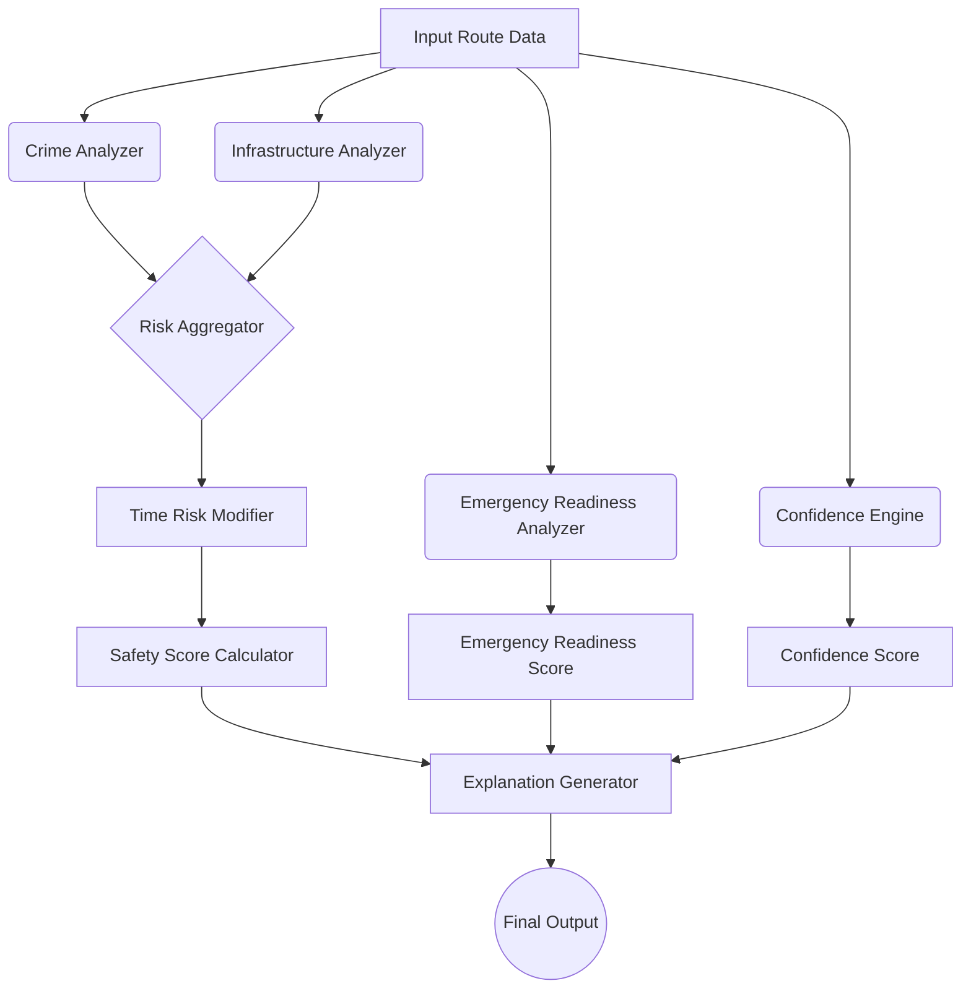

# SafeRoute AI Safety Engine Architecture & Formula Freeze

This document serves as the single source of truth for the SafeRoute AI Safety Engine. It defines the core intelligence, scoring methodology, formulas, and decision-making logic used to calculate route safety.

## 1. AI Safety Engine Architecture

The SafeRoute AI Safety Engine operates on a modular, multi-analyzer architecture. Instead of a single monolithic formula, the engine processes route data through independent analyzers. This ensures high testability, explainability, and future scalability.

### Processing Pipeline



### Module Responsibilities
- **Crime Analyzer:** Evaluates historical crime incidents along the route based on proximity, severity, and recency, outputting raw crime risk.
- **Infrastructure Analyzer:** Evaluates lighting and surveillance coverage along the route, outputting infrastructure risk (e.g., dark spots, lack of CCTV).
- **Time Risk Modifier:** Acts as an environmental multiplier. It amplifies existing infrastructure or crime risks based on the time of day (e.g., lack of lighting is heavily penalized at night but ignored during the day).
- **Risk Aggregator:** Accumulates all adjusted risks into a Total Risk Value.
- **Safety Score Calculator:** Normalizes the Total Accumulated Risk into a 0–100 Safety Score.
- **Emergency Readiness Analyzer:** Calculates response time and distance to critical emergency infrastructure (hospitals, police stations). This is conceptually decoupled from environmental safety.
- **Confidence Engine:** Estimates the reliability of the recommendation based on available spatial data density and coverage.
- **Explanation Generator:** Translates the sub-scores and raw data into a human-readable "Why this route?" summary.

---

## 2. Normalized Risk-First Scoring Methodology

The algorithm abandons arbitrary "base boosts." Instead, it uses a **Risk Accumulation** model. A route starts with a theoretical perfect score of 100, and deductions are applied based on normalized accumulated risk.

**Final Safety Score = MAX(0, 100 - Total Accumulated Risk)**

### 1. Crime Risk
* **Effect:** Accumulates risk points.
* **Factors:**
  * **Proximity:** Incidents within a 100m radius of the route carry maximum impact. Distance decay is applied for incidents further away.
  * **Severity (Multipliers):**
    * **CRITICAL (3.0x):** Murder, Rape, Kidnapping, Armed Robbery.
    * **HIGH (1.5x):** Assault, Snatching, Vehicle Theft.
    * **MODERATE (0.5x):** Pickpocketing, Vandalism, Public Nuisance.
  * **Recency:** Time-decay functions prioritize recent incidents.

### 2. Infrastructure Risk
* **Effect:** Accumulates risk points for deficiencies.
* **Factors:**
  * **Faulty Lights / Dark Spots:** Major risk accumulation, representing vulnerable zones.
  * **Lack of CCTV:** Moderate risk accumulation due to lack of accountability.
  * *Note: Working lights and high CCTV coverage do not "artificially boost" the score above 100; rather, they prevent the accumulation of infrastructure risk.*

### 3. Time Risk Modifier (Contextual Amplifier)
Time of day does not create arbitrary risk. Instead, it amplifies existing environmental vulnerabilities.

* **Morning / Afternoon (06:00 - 18:00):** Multiplier 1.0x. High natural visibility. Infrastructure risk from faulty street lights is completely neutralized (0x multiplier).
* **Evening (18:00 - 22:00):** Multiplier 1.5x on existing Crime Risk. Multiplier 1.0x on Infrastructure Risk.
* **Night (22:00 - 06:00):** Multiplier 2.0x on Crime Risk. Multiplier 3.0x on Infrastructure Risk (a dark street is exceptionally dangerous at night compared to day, but a well-lit street at night accumulates 0 infrastructure risk).

---

## 3. Conceptual Separation: Emergency Readiness

Proximity to a hospital does not prevent a crime, so it should not inflate the core "Safety Score." Instead, it is evaluated as an independent metric: **Emergency Readiness**.

* **Police Stations:** Improve both Safety (via deterrence/patrol proximity risk reduction) and Emergency Readiness (fast response).
* **Hospitals:** Improve ONLY Emergency Readiness.

*Readiness Categories:*
* **High Readiness:** Hospital < 2km, Police < 1km.
* **Moderate Readiness:** Hospital < 5km, Police < 3km.
* **Isolated:** Hospital > 5km, Police > 3km.

---

## 4. The Confidence Engine

The Confidence Engine ensures the AI does not falsely guarantee safety on routes where it has zero data (e.g., newly built roads, rural areas off the grid).

* **Metric:** Confidence Score (0% - 100%).
* **Calculation:** Based on Data Density (number of data points like CCTV, Lights, and historical reporting nodes per kilometer).
* **Thresholds:**
  * **High Confidence (>80%):** Rich dataset, dense infrastructure logging.
  * **Moderate Confidence (50-79%):** Sufficient data to make a reasonable estimate.
  * **Low Confidence (<50%):** "Uncharted Territory." The UI must explicitly warn the user: *"Not enough data for a reliable safety estimate."*

---

## 5. Risk Category Design

Scores are mapped directly to user-friendly risk levels:

* **85 - 100:** 🟢 **Very Safe** (Ideal route, extremely low risk accumulation)
* **70 - 84:** 🟡 **Safe** (Standard route, minor or distant risks)
* **50 - 69:** 🟠 **Moderate** (Caution advised, some missing infrastructure or historical crime)
* **30 - 49:** 🔴 **Risky** (Avoid if possible, poor lighting, documented incidents)
* **0 - 29:** ⚫ **Dangerous** (Do not take this route. High violent crime history, zero visibility)

---

## 6. Explainable AI Design (XAI)

The Explanation Generator parses the Risk Matrix to create a natural language output, explicitly incorporating the separated Emergency Readiness and Confidence levels.

**Output Format:**
```text
Recommended Route: [Route Name]

Safety Score: 88/100 (🟢 Very Safe)
Confidence: 92% (High Data Reliability)
Emergency Readiness: High (Hospital 1.2km away)

Why this route?
✔ Well-lit path (Zero infrastructure risk accumulated)
✔ Dense CCTV coverage
✔ Very low historical crime density

Minor Risks / Warnings:
• Night-time travel amplifies minor baseline risks.
• One moderate-severity incident reported 6 months ago.
```

---

## 7. Scalability Review

**Future Datasets Integration:**
Because the engine uses independent Analyzers and a central Risk Aggregator, adding new datasets is trivial:
1. Create a `WeatherAnalyzer` module.
2. The module outputs an accumulated risk value (e.g., `+15` risk points for heavy rain).
3. The `RiskAggregator` automatically factors it into the deduction math (`100 - Total Risk`).
4. The `ExplanationGenerator` adds a template: `"• Heavy rain accumulating environmental risk"`.

---

## 8. Final Recommendation

**Do not write any code yet.**

If this updated architecture and scoring methodology is approved, the recommended implementation order for **Phase 6.2** will be:
1. Implement the Core Base Classes & Interfaces for Analyzers (Crime, Infrastructure, Readiness).
2. Implement spatial query utilities for data density calculation (Confidence Engine).
3. Implement `TimeRiskModifier` and `RiskAggregator`.
4. Implement `SafetyScoreCalculator` and `ExplanationGenerator`.
