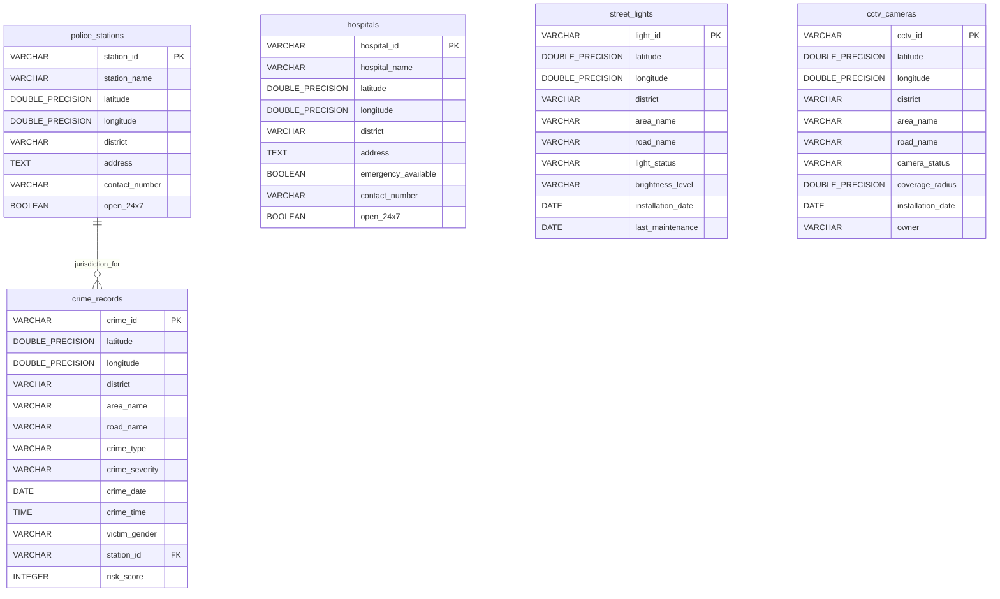

# SafeRoute AI - Database Schema Design (Phase 4.2 - Refined)

This document defines the official, normalized database schema design for SafeRoute AI, mapped directly from the frozen MVP datasets.

---

## 1. Entity Schema Definitions

### 1.1 Police Station (`police_stations`)
Stores verified law enforcement facilities.
- **`station_id`**: `VARCHAR(50)` | Primary Key | NOT NULL
- **`station_name`**: `VARCHAR(150)` | NOT NULL
- **`latitude`**: `DOUBLE PRECISION` | NOT NULL
- **`longitude`**: `DOUBLE PRECISION` | NOT NULL
- **`district`**: `VARCHAR(100)` | NOT NULL
- **`address`**: `TEXT` | Nullable
- **`contact_number`**: `VARCHAR(50)` | Nullable
- **`open_24x7`**: `BOOLEAN` | NOT NULL | Default: `TRUE`

### 1.2 Hospital (`hospitals`)
Stores verified healthcare facilities.
- **`hospital_id`**: `VARCHAR(50)` | Primary Key | NOT NULL
- **`hospital_name`**: `VARCHAR(150)` | NOT NULL
- **`latitude`**: `DOUBLE PRECISION` | NOT NULL
- **`longitude`**: `DOUBLE PRECISION` | NOT NULL
- **`district`**: `VARCHAR(100)` | NOT NULL
- **`address`**: `TEXT` | Nullable
- **`emergency_available`**: `BOOLEAN` | NOT NULL | Default: `TRUE`
- **`contact_number`**: `VARCHAR(50)` | Nullable
- **`open_24x7`**: `BOOLEAN` | NOT NULL | Default: `TRUE`

### 1.3 Street Light (`street_lights`)
Stores public street lighting node details.
- **`light_id`**: `VARCHAR(50)` | Primary Key | NOT NULL
- **`latitude`**: `DOUBLE PRECISION` | NOT NULL
- **`longitude`**: `DOUBLE PRECISION` | NOT NULL
- **`district`**: `VARCHAR(100)` | NOT NULL
- **`area_name`**: `VARCHAR(100)` | NOT NULL
- **`road_name`**: `VARCHAR(150)` | NOT NULL
- **`light_status`**: `VARCHAR(50)` | NOT NULL (e.g., 'Working', 'Faulty')
- **`brightness_level`**: `VARCHAR(50)` | NOT NULL (e.g., 'High', 'Medium', 'Low')
- **`installation_date`**: `DATE` | Nullable
- **`last_maintenance`**: `DATE` | Nullable

### 1.4 CCTV Camera (`cctv_cameras`)
Stores active surveillance camera nodes.
- **`cctv_id`**: `VARCHAR(50)` | Primary Key | NOT NULL
- **`latitude`**: `DOUBLE PRECISION` | NOT NULL
- **`longitude`**: `DOUBLE PRECISION` | NOT NULL
- **`district`**: `VARCHAR(100)` | NOT NULL
- **`area_name`**: `VARCHAR(100)` | NOT NULL
- **`road_name`**: `VARCHAR(150)` | NOT NULL
- **`camera_status`**: `VARCHAR(50)` | NOT NULL (e.g., 'Working', 'Faulty')
- **`coverage_radius`**: `DOUBLE PRECISION` | NOT NULL
- **`installation_date`**: `DATE` | Nullable
- **`owner`**: `VARCHAR(50)` | NOT NULL (e.g., 'Government', 'Private')

### 1.5 Crime Record (`crime_records`)
Stores historical crime incidents mapped to regions and police jurisdictions.
- **`crime_id`**: `VARCHAR(50)` | Primary Key | NOT NULL
- **`latitude`**: `DOUBLE PRECISION` | NOT NULL
- **`longitude`**: `DOUBLE PRECISION` | NOT NULL
- **`district`**: `VARCHAR(100)` | NOT NULL
- **`area_name`**: `VARCHAR(100)` | NOT NULL
- **`road_name`**: `VARCHAR(150)` | NOT NULL
- **`crime_type`**: `VARCHAR(100)` | NOT NULL
- **`crime_severity`**: `VARCHAR(50)` | NOT NULL (e.g., 'High', 'Medium', 'Low')
- **`crime_date`**: `DATE` | NOT NULL
- **`crime_time`**: `TIME` | NOT NULL
- **`victim_gender`**: `VARCHAR(50)` | Nullable
- **`station_id`**: `VARCHAR(50)` | Foreign Key -> `police_stations.station_id` | NOT NULL
- **`risk_score`**: `INTEGER` | NOT NULL

---

## 2. Entity Relationship Diagram (ERD)

---

## 3. Relationships & Normalization Rationale

- **`police_stations` to `crime_records` (One-to-Many):** A single police station acts as the primary responder for multiple crimes occurring within its sector. The relationship is maintained via `crime_records.station_id` referencing `police_stations.station_id`. This normalized foreign key configuration guarantees referential integrity even if station names are updated or changed in the future.
- **District Column Denormalization:** The `district` column is intentionally kept across all tables. This denormalization simplifies region-wide filtering, improves query speeds, and optimizes performance for the hackathon MVP routing engine.
- **Infrastructure Datasets:** `street_lights` and `cctv_cameras` operate independently as points of interest (POIs) with no direct relational joins to `crime_records` in the database. Instead, spatial/geographical proximity checks are calculated at the application layer by the AI routing module.

---

## 4. Index Strategy

To optimize safety calculation queries and route lookup performance, the following indexes are proposed:

1.  **Spatial Indexes (Coordinate Lookups):**
    - `idx_crimes_lat_lng` on `crime_records (latitude, longitude)`
    - `idx_lights_lat_lng` on `street_lights (latitude, longitude)`
    - `idx_cctv_lat_lng` on `cctv_cameras (latitude, longitude)`
    *Rationale:* Allows fast radial lookup (e.g., "find all lights/crimes within 100 meters of a coordinate").

2.  **Coverage District/Road Filters:**
    - `idx_crimes_district_road` on `crime_records (district, road_name)`
    - `idx_lights_district_road` on `street_lights (district, road_name)`
    - `idx_cctv_district_road` on `cctv_cameras (district, road_name)`
    *Rationale:* Enhances text-based filters when computing segment safety ratings.

3.  **Crime Temporal & Severity Filters:**
    - `idx_crimes_date_score` on `crime_records (crime_date, risk_score DESC)`
    *Rationale:* Assists in fetching recent high-risk incidents quickly.

---

## 5. Constraint Strategy

- **Coordinate Bounds Validation:**
  - `CHECK (latitude BETWEEN -90.0 AND 90.0)`
  - `CHECK (longitude BETWEEN -180.0 AND 180.0)`
- **Risk Score Boundary Validation:**
  - `CHECK (risk_score BETWEEN 0 AND 100)`
- **Status Constraints:**
  - `CHECK (light_status IN ('Working', 'Faulty'))`
  - `CHECK (camera_status IN ('Working', 'Faulty'))`
- **Severity Level Limits:**
  - `CHECK (crime_severity IN ('High', 'Medium', 'Low'))`

---

## 6. Future Scalability Review

- **PostGIS Support:** For production scale, the `latitude` and `longitude` fields can easily migrate to PostGIS `GEOGRAPHY(Point, 4326)` columns, which automatically unlocks spatial functions like `ST_DWithin` and `ST_Distance`.
- **User and App Entities Support:**
  - **`users`:** Can link to `community_reports` (user-reported hazards) using `user_id`.
  - **`saved_routes`:** Will store path segments and reference `users.id`.
  - **`emergency_contacts` & `sos_events`:** Relate directly to users, allowing real-time tracking during active SOS alerts.
